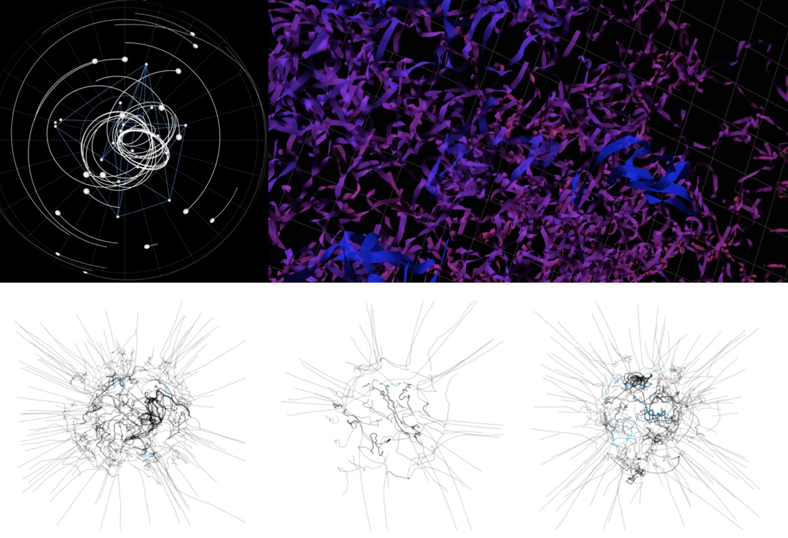

At CoLabo, we are looking forward to engage with the wider community through projects that have applications in STEM education and also through experimentation at the interface between science and art. Research in bioinformatics has a growing social impact as computational study of biomedical data leads to novel treatment of diseases and other advancements. Thus, we'll aim at reaching out to the community to facilitate conversations and interest in STEM topics.

<!--more-->

Andrés Colubri, the PI of CoLabo, contributed for many years to the [Processing project](https://processing.org/), which is not only a widely-used programming environment and language for digital arts and design, but also a community that focuses in the promotion software literacy within the visual arts, and visual literacy within technology-related fields — and in making these fields more incluse, diverse, and accessible. [Andrés' work](https://andrescolubri.net/projects/) prior to starting CoLabo at UMass Medical School also included artistic experiments with [code](https://andrescolubri.net/projects/p5android.html), [data](https://andrescolubri.net/projects/espacio.html), and [live visuals](https://andrescolubri.net/projects/latent.html), and the goal is to find find in which the research in the lab does not conclude with a paper but continue into community outreach, STEM education, and unexpected explorations. Below we have some ongoing leads that would help realizing this goal.

## ScienceLIVE program at UMass Medical School

The [ScienceLIVE](https://www.umassmed.edu/rti/rnaworld/Science-LIVE/) outreach program is an an effort joint effort from the RNA Therapeutics Institute ([RTI](https://www.umassmed.edu/rti/)), Department of Microbiology and Physiological Systems ([MaPS](https://www.umassmed.edu/maps/)) and Sanderson Center for Optical Experimentation ([SCOPE](https://www.umassmed.edu/scope/)) at Umass Medical School to support the Worcester teachers through virtual content that enhances the existing curriculum while introducing the students to a diverse array of STEM professionals at various career stages at UMMS. It currently offers a set curriculum for the schools, but plans are do more development over the upcoming sessions. We are exploring ways in which CoLabo could contribute to expand the scope and scale of the program, including through outside funding.

## Education in infectious diseases with Operation Outbreak

We are working on the epidemological modeling and tech development aspects of the [Operation Outbreak](operationoutbreak.org/) project mentioned elsewhere, but this is primarily an educational platform for middle and high schools on "Outbreak science". As such, it give us the opportunity to work with schools around the country to ensure that this platform is engaging for students and has a measurable impact in STEM education outcomes. We hope that this project will continue to grow in the near future, and incorporate new elements in the app and visualization dashboard.

## Contributing to Processing and other open-source projects

Community-based projects such as Processing show the impact that freely available, open source tools can have in education and outreach. At CoLabo, we will find ways in which our work can support and be supported by Processing and other open source projects in science, arts, and design.
